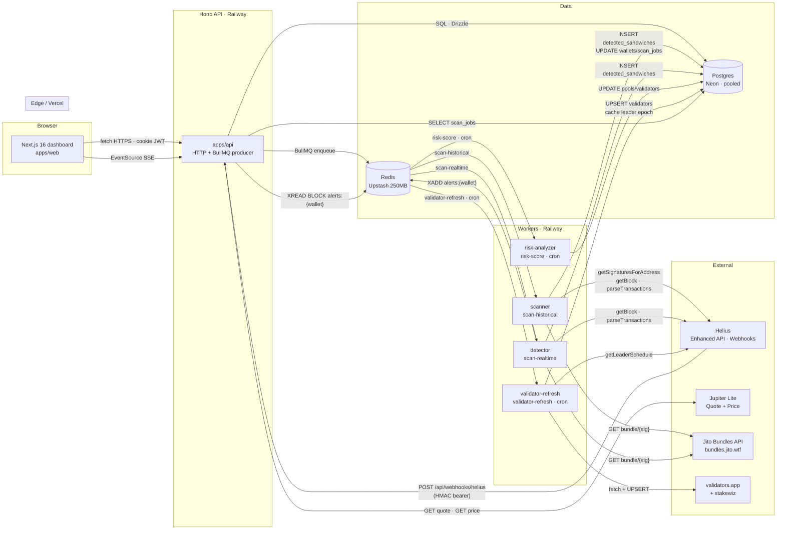
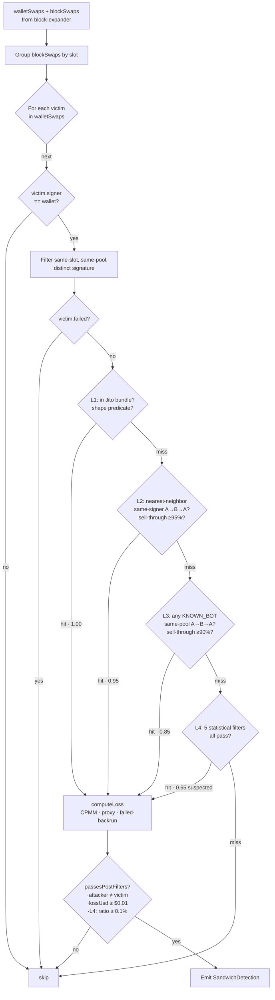
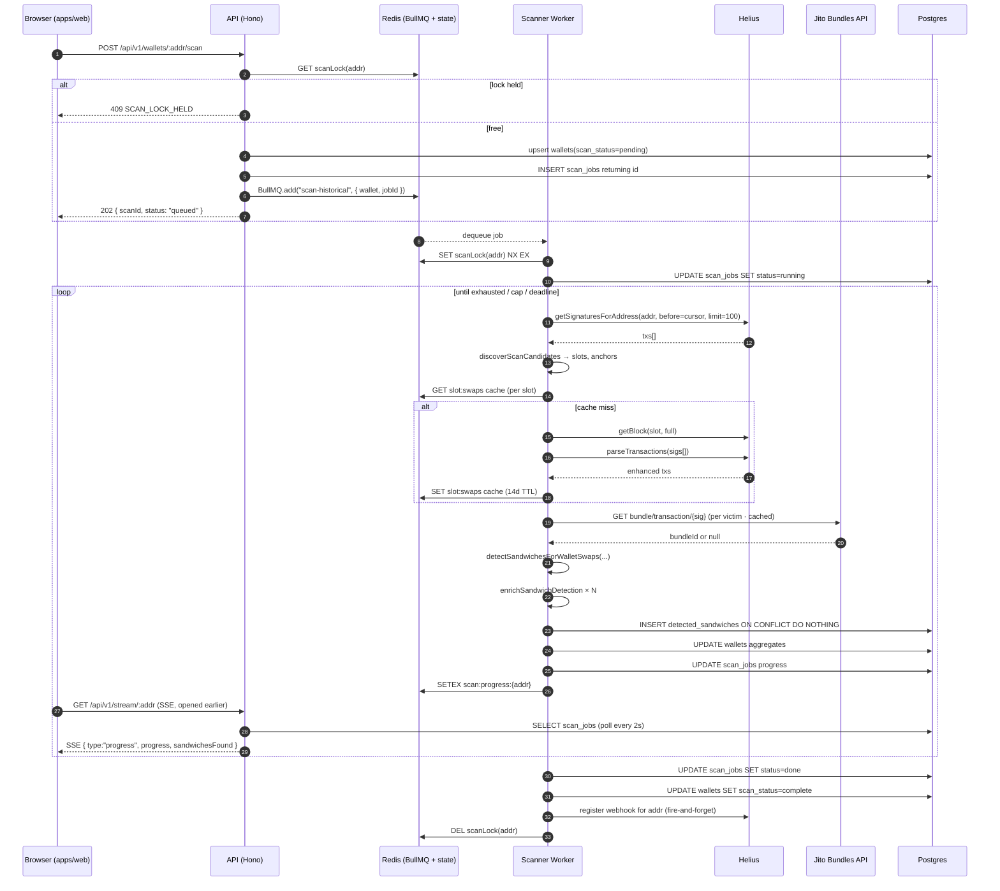
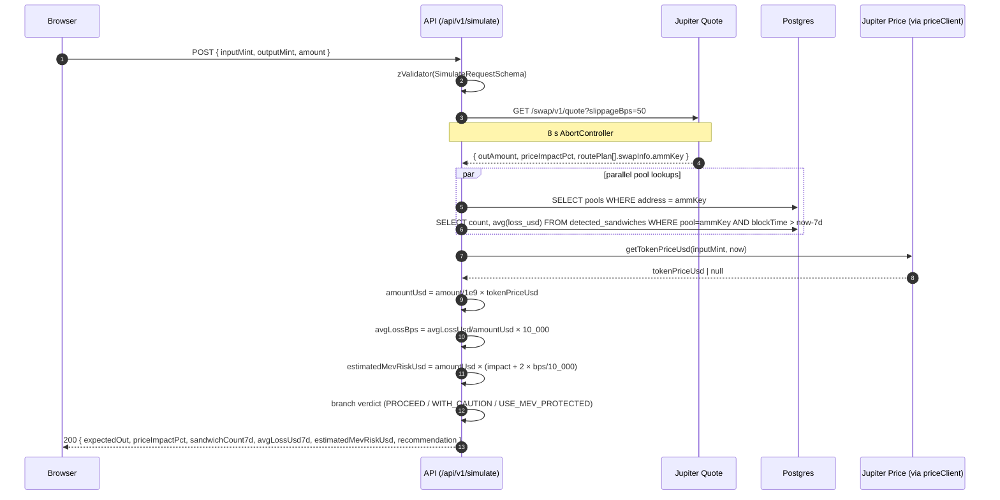
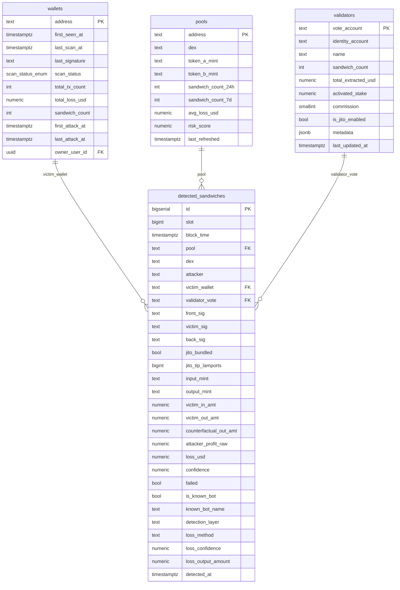

# Architecture

> Get Toasted (formerly *MEV Shield* in early planning docs) — a sandwich-attack
> scanner for Solana wallets. This document describes the system as it exists
> in the repository today.

**Audience.** Two readers, two halves:

- [Part 1 — Layman](#part-1--for-the-trader-judge) explains the product in
  trading terms with one worked example.
- [Part 2 — Engineer](#part-2--senior-engineer-walkthrough) covers the
  subsystems with file paths, function names, and failure modes.
- [Part 3 — Diagrams](#part-3--diagrams) contains five Mermaid diagrams.
- [Documented but not shipped](#documented-but-not-shipped) lists features
  named in earlier specs that are not in the current codebase.

**A note on input documents.** The original task referenced a low-level
design document (`MEV_Shield_Low_Level_Architecture`) and a build-plan
document (`MEV Shield — Lean 10-Day Stack`). Neither is present in the
repository. This document is grounded in `README.md`, `DETECTOR.md`,
`SUBMISSION.md`, `BACKLOG.md`, and the source tree. Where those companion
docs disagree with the code as of this commit, the code wins and the
disagreement is flagged with **⚠️ Divergence**.

---

## Part 1 — For the trader / judge

### What is a sandwich attack?

A sandwich is a three-trade pattern executed by a bot around your trade in
the **same Solana block**:

1. **Front-run.** The bot sees your pending swap (or, on Solana, gets first
   slot priority via co-located infrastructure) and buys the same asset
   first. This nudges the AMM price *up*.
2. **Victim trade (you).** Your transaction lands at the new, worse price.
   You pay more SOL for fewer tokens than you would have paid one second
   earlier.
3. **Back-run.** The bot immediately sells what it just bought, pocketing
   the price difference your trade created.

#### Concrete example: $1,000 SOL → BONK

Suppose you swap **6 SOL (~$1,000 at $167/SOL)** for BONK on a Raydium pool
holding 10,000 SOL and 25,000,000,000 BONK (1 BONK ≈ 0.0000004 SOL).

| Step | Actor | Action | Pool after | Result |
|---|---|---|---|---|
| 0 | — | starting reserves | 10,000 SOL / 25.0 B BONK | mid = 2,500,000 BONK/SOL |
| 1 | **bot front-run** | buys ~30 SOL of BONK | 10,030 SOL / 24.925 B BONK | bot holds 75M BONK |
| 2 | **you (victim)** | swap 6 SOL for BONK at the worsened price | 10,036 SOL / ~14.9M BONK fewer | you receive **~14,898,000 BONK** instead of the **~14,955,000 BONK** you'd have received without step 1 |
| 3 | **bot back-run** | sells the 75M BONK back into the same pool | pool drains the price impact your trade created | bot exits with **~30.07 SOL** (≈0.07 SOL profit, **~$11.69**) |

You are out **~57,000 BONK ≈ $11.40** versus what an unsandwiched fill
would have given you. That's ~1.1% of trade size — a typical extraction
band. The bot's back-run profit is your loss, modulo a small portion of
LP fees the bot pays going both directions.

> The numbers above are illustrative — the actual extraction depends on
> pool depth, the bot's front-run size (chosen to maximise extraction
> within your slippage tolerance), and the AMM's fee tier. The mechanism
> is what matters: you ate the price impact the bot deliberately created.

### Why is this hard to detect on Solana?

Three properties of Solana make sandwich detection harder than, say, on
Ethereum:

- **No public mempool.** Solana validators don't gossip a global mempool.
  Bots get attack opportunities from co-located infrastructure (Jito's
  block engine, validator-side staked RPC nodes, or direct relationships
  with the current slot leader). The "dark forest" is darker.
- **Atomic bundles.** Through Jito, attackers submit the front-run /
  victim / back-run as one **atomic bundle** that lands together. From
  the chain's perspective there is no time gap to observe.
- **High throughput.** A busy block has 1,500–4,000+ transactions. The
  signal (one bot's two swaps + your swap on a specific pool) is buried
  in noise that includes legitimate arbitrage, market-making, and
  routine liquidity provision — many of which superficially also look
  like A→B→A patterns.
- **Multi-program routing.** Aggregators like Jupiter break a single user
  swap into 4–8 inner instructions across multiple DEXes. A naive
  detector that only inspects outer instructions misses the route entirely
  (this caused real false negatives — see `DETECTOR.md` "Bug 1").

### How does Get Toasted find these?

Plain-English version of the algorithm. The technical version is in
[Part 2 — Detection algorithm](#2-detection-algorithm).

1. **Pull the wallet's history.** Ask Helius for every signed transaction
   the wallet has ever made (newest first, paginated).
2. **Filter to candidate slots.** Keep only the slots where the wallet
   touched a DEX program — outer or inner instructions, including
   Jupiter's nested route swaps.
3. **Expand each block.** For every candidate slot, fetch *all* swaps in
   the block on tracked DEXes (cached for 14 days because finalized
   blocks are immutable).
4. **Look for the A→B→A fingerprint.** Within each (slot, pool) group, see
   whether some other signer has a swap *before* the wallet's swap in the
   same direction, and a *reverse* swap *after* the wallet's swap, and
   whether the back-run sells back ≥95% of what the front-run bought.
   That's the fingerprint.
5. **Score it.** Run four classification layers in priority order: Jito
   bundle (highest confidence), block adjacency, known-bot, statistical.
   First match wins.
6. **Compute the dollar loss.** Pick the best-available method (CPMM
   counterfactual, back-run profit proxy, or failed-back-run estimate)
   and convert to USD via Jupiter's price feed.
7. **Persist + stream.** Insert into Postgres, push a Server-Sent Event
   to any open dashboard tab.

Same-pool / opposite-direction filtering automatically rejects pure
arbitrage (which spans multiple pools) and reverts (which don't move
balances).

### Why is the dollar number trustworthy?

Two methods are used; the one with the higher reconstruction confidence wins:

- **CPMM counterfactual** (confidence 1.00). For constant-product pools
  (Raydium V4, Raydium CPMM, Orca classic, Meteora classic, PumpSwap),
  the AMM obeys `x · y = k`. We re-run *your* swap math against the pool
  reserves *before the bot's front-run*. The difference between what you
  *would have received* and what you *did receive* is the loss — exact,
  not estimated, modulo sub-lamport BigInt rounding.
- **Back-run profit proxy** (confidence 0.85). For concentrated-liquidity
  pools (CLMM) where reserves don't fully describe price, or when reserve
  data is missing, we use the bot's own realised profit (`back-run output
  − front-run input`) as a proxy for your loss. In a sandwich, the bot's
  profit *is* the price impact you ate — they're the same dollars,
  flowing the opposite direction. We subtract any Jito tip the bot paid
  (so we don't over-credit them) and convert via your trade's implied
  exchange rate.

Both numbers are then denominated in USD using **Jupiter's Price API
v3** at the block timestamp. If the output token has no Jupiter price
(long-tail memecoins), the loss is reported as `≈ X TOKEN (USD unknown)`
rather than the misleading `$0`.

### Visual: the sandwich pattern

```
                       BLOCK N (one slot, ~400ms)
   ┌────────────────────────────────────────────────────────────────┐
   │                                                                │
   │   tx[i]              tx[i+1]                tx[i+2]            │
   │   ┌──────────┐       ┌──────────┐           ┌──────────┐       │
   │   │ FRONT    │       │  VICTIM  │           │  BACK    │       │
   │   │  bot →   │       │   you →  │           │  bot →   │       │
   │   │ buy SOL  │   →   │ buy SOL  │     →     │ sell SOL │       │
   │   │ price ↑  │       │ worse $  │           │ captures │       │
   │   └────┬─────┘       └──────────┘           └────┬─────┘       │
   │        │                  │                      │             │
   │        │                  ▼                      │             │
   │        │            (your loss ≈ Δprice)         │             │
   │        │                                         │             │
   │        └─── same signer, opposite directions ────┘             │
   │             same DEX pool                                      │
   │                                                                │
   └────────────────────────────────────────────────────────────────┘

   what we look for:  signer(front) == signer(back) != signer(victim)
                      pool(front) == pool(victim) == pool(back)
                      front: A → B   ;  victim: A → B   ;  back: B → A
                      back.input ≥ 0.95 × front.output   (sell-through)
```

---

## Part 2 — Senior engineer walkthrough

### 1. Scan pipeline

**Goal.** Given a wallet address, enumerate every historical sandwich
that targeted it and persist a structured row per detection.

#### Data flow

```
browser  ─POST /api/v1/wallets/:addr/scan──►  apps/api (Hono)
                                                   │
                                                   │ enqueue { wallet, jobId }
                                                   ▼
                                    BullMQ "scan-historical"  (Upstash Redis)
                                                   │
                                                   ▼
                                       apps/workers/scanner
                                                   │
                              ┌────────────────────┼─────────────────────┐
                              ▼                    ▼                     ▼
                    Helius getSignatures  Helius getBlock +    @get-toasted/core
                    ForAddress            parseTransactions    detectSandwiches…
                              │                    │                     │
                              └────────► block-expander ◄─── Redis cache (14d) ─┘
                                                   │
                                                   ▼
                                        enrichSandwichDetection
                                          (validator vote · USD · decimals)
                                                   │
                                                   ▼
                                  Sandwiches.batchInsertDetections
                                           (Postgres · upsert)
                                                   │
                                                   ▼
                                  XADD redisKeys.alertsQueue(wallet)
                                                   │
                                                   ▼
                                 GET /api/v1/stream/:addr  (SSE fan-out)
```

#### Files

- `apps/api/src/routes/v1/wallets.ts:152-181` — `POST /:address/scan`
  acquires a Redis scan-lock (`redisKeys.scanLock`), upserts a `wallets`
  row to `pending`, creates a `scan_jobs` row, and enqueues a BullMQ job
  with `jobId === scanJobs.id` so duplicate enqueues collapse.
- `apps/workers/scanner/src/index.ts:223-428` — `processJob`. Holds the
  scan lock for `SCAN_LOCK_TTL_SECONDS`, paginates Helius signatures
  (100 at a time), discovers candidate slots, dispatches block expansion,
  runs detection, enriches, batch-inserts.
- `apps/workers/scanner/src/index.ts:121-157` — `discoverScanCandidates`
  + `walletTxTouchesTrackedDex`. **Critically**, this checks both
  `tx.instructions[*].programId` (and one level of `innerInstructions`)
  *and* `tx.events.swap.innerSwaps[*].programInfo.account` — the latter
  is the only way Jupiter-routed victims are picked up, since Jupiter is
  the outer program and is not in `TRACKED_DEX_PROGRAM_IDS`.
- `packages/runtime/src/block-expander.ts` — `getBlockSwaps(slot, {
  anchorSigs, windowSize })`. Cached at `slot:swaps:{slot}` (full block)
  or a deterministic hash key (anchor-narrowed). 14-day TTL.
- `packages/runtime/src/detection-enricher.ts` — `enrichSandwichDetection`.
  Resolves validator vote account, output-token decimals, USD price.
- `apps/api/src/routes/v1/stream.ts` — Server-Sent-Events handler.
  Two timers (heartbeat 15s, scan-job poll 2s) plus a blocking
  `XREAD BLOCK 5000` against `redisKeys.alertsQueue(address)`.

#### Credit math

The scanner's **Helius credit budget per scan** is bounded by three env
vars (`packages/env/src/index.ts`):

| Env var | Default | Purpose |
|---|---|---|
| `MAX_SCAN_SIGNATURES` | 1000 | Stop after this many wallet signatures |
| `MAX_SCAN_SLOTS` | 200 | Stop after expanding this many unique slots |
| `MAX_SCAN_DURATION_MS` | 60000 | Hard wall-clock cap |

Per scan, in the worst case:

```
gSFA pages       ≈ 1000 / 100         = 10 calls          ×    1 credit  =    10
candidate slots  ≤ 200                                                          
getBlock         ≈ 200 (one per slot)                     ×    5 credits = 1,000
parseTx (Helius enhanced)
                 ≈ 200 × ~6 candidates per anchor window  × 0.001 credit =    ~1
jito bundle lookup
                 cached after first hit (7d TTL)                          
─────────────────────────────────────────────────────────────────────────────
total                                                                    ≈ 5,011
```

A 10M-credit Helius developer plan therefore comfortably supports
~2,000 wallet scans per month. Block-expansion cache hits (cross-wallet,
re-scan) cost zero additional credits.

#### Failure modes we handle

- **Scan-lock contention.** Two concurrent `/scan` calls for the same
  wallet: the second receives `409 SCAN_LOCK_HELD`. The lock TTL
  (`SCAN_LOCK_TTL_SECONDS`) auto-recovers if the worker dies mid-scan.
- **Time-budget exhaustion.** If `MAX_SCAN_DURATION_MS` is hit, the
  worker sets `stopReason: "budget"` and completes with partial results.
  No requeue — the dashboard surfaces the partial number; user can
  re-trigger if they want backfill.
- **Helius transient error.** `block-expander.getBlockSwaps` returns
  `[]` on RPC failure rather than throwing. The current slot is treated
  as no-detection; the scanner moves on.
- **Webhook auto-registration failure.** After a successful scan, the
  scanner calls `webhooks.registerWallet(wallet)`. If Helius's webhook
  API is down, this is logged at `warn` and is non-fatal — the scan still
  completes. Real-time alerts for that wallet won't fire until the next
  attempt.
- **Invalid wallet address.** Surfaces as `UnrecoverableError` so BullMQ
  doesn't retry. Marks both `scan_jobs.status = failed` and
  `wallets.scan_status = failed`.

#### Deliberately not built

- **Cross-wallet batched scans.** Out of scope for v1
  (`CLAUDE.md` "Out of Scope").
- **SIWS-gated scans.** The scan endpoint intentionally does not use the
  `authMiddleware` from `apps/api/src/middleware/auth.ts`. The hackathon
  demo flow is "paste a wallet, see results" without an auth wall.
  See `apps/api/src/routes/v1/wallets.ts:148-151`.
- **Resumable scans across worker restarts.** `scan_jobs.cursor` is
  persisted, but the BullMQ job carries a snapshot — if a worker dies
  mid-batch, BullMQ retries from the start of the job, not the cursor.
  Acceptable because Helius pagination is reverse-chronological and the
  most-recent activity is what users care about.

---

### 2. Detection algorithm

The detector lives entirely in `@get-toasted/core` (no Node-only
imports — same code runs in tests, harness, and both workers).
Orchestration is `detectSandwichesForWalletSwaps` (`packages/core/src/detector.ts`):

> ⚠️ **Divergence from spec.** Earlier docs reference `detectSandwichesInSlot`.
> The actual function is `detectSandwichesForWalletSwaps`, which buckets
> the input by slot internally rather than being called per-slot. The
> per-victim entry point is `detectSandwichForVictim`. The slot-bucket
> rewrite happened with the layered-detector landing.

#### The orchestrator (annotated)

```ts
// packages/core/src/detector.ts:118-158
export async function detectSandwichesForWalletSwaps(params: {
  wallet: string;
  walletSwaps: ParsedSwap[];   // the wallet's own swaps
  blockSwaps: ParsedSwap[];    // block-expanded same-block context
  jito: JitoBundleResolver;
  now?: () => Date;
}): Promise<SandwichDetection[]> {
  const { wallet, walletSwaps, blockSwaps, jito } = params;

  // ── (1) Group block swaps by slot ──
  // Detection only operates on swaps in the victim's slot. Cross-slot
  // detection (L5) is out of scope until L4 false-positive rate is
  // validated against ground truth (DETECTOR.md "Rolling out L5").
  const bySlot = new Map<string, ParsedSwap[]>();
  for (const s of blockSwaps) {
    const k = s.slot.toString();
    const bucket = bySlot.get(k);
    if (bucket) bucket.push(s);
    else bySlot.set(k, [s]);
  }

  const out: SandwichDetection[] = [];
  for (const victim of walletSwaps) {
    // ── (2) Identity guard ──
    // The wallet may appear as the *attacker* in its own swaps (round-
    // trip arb on a wallet that also runs a bot). Skip — those aren't
    // sandwich victims.
    if (victim.signer !== wallet) continue;

    // ── (3) Same-pool, distinct-tx candidate set ──
    // Sandwich shape requires same pool. Cross-pool legs are not
    // sandwiches; arbitrage routes between pools are filtered out
    // automatically by this single line.
    const sameSlot = bySlot.get(victim.slot.toString()) ?? [];
    const candidates = sameSlot.filter(
      (s) => s.pool === victim.pool && s.signature !== victim.signature,
    );

    // ── (4) Run the layered classifier ──
    // detectSandwichForVictim runs L1 → L2 → L3 → L4, short-circuiting
    // at the first match. Loss + post-filters are applied internally.
    const detection = await detectSandwichForVictim({
      victim, candidates, jito, now: params.now,
    });
    if (detection) out.push(detection);
  }

  return out;
}
```

#### The classifier (`detectSandwichForVictim`, same file:59-106)

```
victim.failed?  ──yes──► return null      (failed swap can't be sandwiched)
       │ no
       ▼
   ┌───────┐  hit  ┌──────────────────────────┐
   │  L1   │──────►│ build LayerMatch (1.00)  │
   └───┬───┘       └───────────┬──────────────┘
       │ miss                  │
       ▼                       │
   ┌───────┐  hit              │
   │  L2   │────► (0.95) ──────┤
   └───┬───┘                   │
       │ miss                  │
       ▼                       │
   ┌───────┐  hit              │
   │  L3   │────► (0.85) ──────┤
   └───┬───┘                   │
       │ miss                  │
       ▼                       │
   ┌───────┐  hit              │
   │  L4   │────► (0.65) ──────┤
   └───┬───┘                   │
       │ miss                  │
       ▼                       ▼
     null              computeLoss()  →  passesPostFilters()  →  emit
```

#### The shape predicate (the heart of every layer)

```ts
// packages/core/src/detector-l1.ts:82-96 — reused by L2/L3/L4
export function isSandwichShape(victim, frontRun, backRun): boolean {
  if (frontRun.signer !== backRun.signer) return false;
  if (frontRun.signer === victim.signer) return false; // self-sandwich
  if (frontRun.pool !== victim.pool) return false;
  if (backRun.pool !== victim.pool) return false;
  if (frontRun.inputMint !== victim.inputMint) return false;
  if (frontRun.outputMint !== victim.outputMint) return false;
  if (backRun.inputMint !== frontRun.outputMint) return false;
  if (backRun.outputMint !== frontRun.inputMint) return false;
  return true;
}
```

Why this single predicate kills arbitrage automatically:

- **Same pool requirement.** Pure arbitrage moves between pools — the
  classic "buy SOL on Orca, sell SOL on Raydium" triangle never has
  `frontRun.pool === victim.pool === backRun.pool`. Ruled out.
- **Reversed directions.** A back-run that goes the *same* direction as
  the front-run is the bot continuing a position, not closing one. Not
  a sandwich.
- **Different signer for victim vs attacker.** A wallet sandwiching
  itself (round-trip MM strategy) is not what users care about.

#### Layer-specific extras

| Layer | File | Extra signals | Confidence | Status |
|---|---|---|---|---|
| L1 | `detector-l1.ts` | Bot's three sigs share a Jito bundle id. Cached via `runtime/jito-bundle.ts`. Falls through on Jito API failure. | 1.00 | confirmed |
| L2 | `detector-l2.ts` | **Nearest-neighbor** by `txIndexInBlock` — finds the closest preceding & following same-pool same-signer pair. Sell-through ≥95%. | 0.95 | confirmed |
| L3 | `detector-l3.ts` | Filters candidates to `KNOWN_SANDWICH_BOTS` first, ignoring adjacency. Sell-through ≥90%. | 0.85 | confirmed |
| L4 | `detector-l4.ts` | Statistical: 5 false-positive guards (sell-through ≥85%, non-negative proxy profit, size ratio 0.05×–25× victim, index proximity ≤20). | 0.65 | suspected |

> ⚠️ **Divergence — L1 status.** `DETECTOR.md` records L1 as re-enabled
> 2026-05-07 (commit chained the two `bundles.jito.wtf` endpoints with
> Redis cache). The doc-comment in `detector.ts:74` still reads
> "currently disabled pending a paid Jito indexer integration — always
> returns null". The implementation in `detector-l1.ts` is live; the
> comment in `detector.ts` is stale. Treat L1 as live in production.

#### Loss formula — back-run profit proxy

The default for all layers when CPMM math doesn't apply
(`packages/core/src/detector-loss.ts:163-194`):

```
proxyProfit       = backRun.output  −  frontRun.input
                    (subtract Jito tip when both are SOL-denominated)
                    (clamp at 0; failed back-runs go to a different method)

lossInOutputToken = proxyProfit  ×  victim.output  /  victim.input
                    (proxy profit is in input-token units; convert
                     to victim output-token units via implied rate)
```

This is approximate — the rate moved during the attack — so it's tagged
`lossConfidence: 0.85`. The CPMM method (`reconstructCpmmLoss`,
`detector-loss.ts:70-151`) is the exact `x·y=k` counterfactual when
reserves are available; on numerical / mint-mismatch failures it falls
through to the proxy with `lossConfidence: 0`.

The dispatcher's selection order is:

```
isCpmmDex(dex) && reservesBefore present
   └─► reconstructCpmmLoss → if confidence > 0, use it
backRun.failed || backRun.output ≤ frontRun.input
   └─► failedBackrunLoss (rate-delta estimate, confidence 0.50)
otherwise
   └─► backrunProxyLoss (confidence 0.85)
```

#### Post-filters (`detector-filters.ts`)

- **Guard 1:** `attacker === victim.signer` → drop. Belt-and-suspenders;
  layer detectors already exclude self-signer matches.
- **Guard 2a:** `lossUsd < $0.01` → drop. Skipped when `lossUsd` is null
  (long-tail mint, no Jupiter price) — null means "unknown", not zero.
- **Guard 2b:** `loss / victim.output < 0.1%` → drop. **L4 only.**
  Applying this guard to L1/L2/L3 silently discarded ground-truth
  Jito-bundle confirmed sandwiches with low-extraction (one in ten on
  the mined fixture set — see `DETECTOR.md` "Bug 6").

#### Edge cases handled

| Case | Handling |
|---|---|
| Failed victim swap | Skipped at `detectSandwichForVictim:70` |
| Failed back-run | Routed to `failedBackrunLoss` (confidence 0.50, "estimated"). Detection still emitted. |
| Jupiter multi-hop victim | Picked up by `walletTxTouchesTrackedDex` checking `events.swap.innerSwaps`. The block-expander then sees the Jupiter sub-program calls. |
| Tip transfer between bot legs | L1 tolerates arbitrary non-DEX intermediates (it walks bundle indices, not block indices). L2's nearest-neighbor walk also tolerates them (it ignores non-DEX txs, only walking same-pool candidates). |
| Long-tail memecoin with no USD price | `lossUsd: null` is preserved; UI renders "≈X TOKEN (USD unknown)". When the *input* mint is SOL, the enricher (`detection-enricher.ts:82-91`) falls back to `attackerProfitRaw × SOL price` to avoid showing $0 on confirmed attacks. |
| Self-sandwich (wallet runs a bot under same key) | Killed at the layer level (`isSandwichShape`) plus Guard 1. |

#### Edge cases deferred

| Case | Reason |
|---|---|
| L5 — cross-slot wide sandwich | Per `DETECTOR.md` §13, L5 is the noisiest layer; ship-validate-iterate requires L4 false-positive rate to be characterised first. Code stub exists; not wired. |
| JIT liquidity attacks | Different mechanism; not in v1 scope (`CLAUDE.md` "Out of Scope"). |
| "Blind" sandwiches by unknown attackers on long-tail pools | Detected at L4 with `status: 'suspected'`. UI distinguishes from confirmed. |
| Phoenix Eternal (perpetuals AMM) | Intentionally not in `TRACKED_DEX_PROGRAM_IDS`. Spline-AMM perp loss math differs from CPMM/CLMM; speculatively adding it would route legitimate same-block opens-then-closes through the sandwich predicate and produce false positives. See `BACKLOG.md` "Phoenix Eternal coverage". |

---

### 3. Validator attribution

**Goal.** For each detected sandwich, label which validator was the slot
leader, and aggregate per-validator statistics.

#### Data flow

```
validator-refresh worker (cron, 24h)
  ├─ fetch validators.app  (HTTP, optional token)
  ├─ fetch stakewiz API     (HTTP, no auth)
  ├─ Validators.upsertValidatorBatch  (Postgres)
  ├─ Validators.recomputeValidatorSandwichStats  (Postgres aggregate UPDATE)
  └─ leader.hydrateEpoch(currentEpoch)   (Helius getLeaderSchedule → Redis)

scanner / detector worker
  └─ enrichSandwichDetection
       └─ leader.getValidatorForSlot(slot)
              ├─ slot → epoch  (slot / 432_000)
              ├─ Redis HIT?  → look up slot in cached map → return identity
              └─ MISS  → hydrateEpoch(epoch)  → retry  → cache miss returns null
```

#### Files

- `packages/runtime/src/leader-schedule.ts` — `LeaderScheduleCache`.
  `slotToEpoch(slot)` = `Number(slot / 432_000n)`. Per-epoch JSON map of
  `slot → identity_account`, cached at `redisKeys.leaderEpoch(epoch)` for
  `LEADER_SCHEDULE_TTL_SECONDS`.
- `apps/workers/validator-refresh/src/index.ts` — daily sweep, BullMQ
  job-scheduler `validator-refresh-daily`. Merges
  `validators.app` (commission, name, jito flag) with `stakewiz` (jito
  commission bps).
- `packages/db/src/queries/validators.ts:34-51` —
  `recomputeValidatorSandwichStats`. Single `UPDATE … FROM (SELECT …
  GROUP BY validator_vote)` against `detected_sandwiches`. Recomputed
  hourly by the risk-analyzer's `risk-score` cron, daily by validator-
  refresh.
- `packages/db/src/queries/validators.ts:55-89` — `getValidatorLeaderboard`
  with three sort orders: `sandwiches`, `extracted_usd`,
  `sandwich_rate` (=`sandwich_count / activated_stake`).

#### The "sandwich rate" methodology — and its caveat

`sandwich_rate` is computed as `sandwich_count_attributed_to_leader /
activated_stake_lamports`. The intent: identify validators whose blocks
contain disproportionately many sandwiches relative to the share of slots
they're scheduled to lead.

> ⚠️ **Caveat.** Leader ≠ bot operator. A validator being "leader of a
> slot containing a sandwich" means they were scheduled to produce that
> block. The sandwich was submitted by a third-party searcher (often via
> Jito's block engine; sometimes via a private orderflow agreement with
> the leader). High `sandwich_rate` is **not** evidence the validator
> operator is the attacker — it can equally indicate (a) a validator
> running Jito-MEV with no filtering, (b) a validator with a private
> orderflow deal with a sandwich operator, or (c) statistical noise on a
> small-stake validator. The leaderboard is presented as "where to
> avoid landing if you don't want sandwich exposure", not as accusation.

#### Failure modes

- **`validators.app` token missing.** Logged at `warn`; sweep continues
  with stakewiz alone (yields a much smaller dataset). Validator names
  may go missing; vote accounts still resolved from the leader schedule.
- **Helius `getLeaderSchedule` returns `{}`.** Logged at `warn`; the
  cache is not poisoned (no write). Next request falls back to a per-slot
  hydrate attempt.
- **Slot's epoch not yet hydrated.** `getValidatorForSlot` triggers a
  synchronous `hydrateEpoch(epoch)` before returning. Single epoch
  hydrate is ~50KB; the latency hit is ~200ms first time, then cached.

#### Deliberately not built

- **Per-validator real-time alerting.** Validators are surfaced in the
  leaderboard, not pushed via SSE.
- **Stake-weighted sandwich rate normalization.** We expose the raw
  ratio; users can sort by it but we don't bucket / Bayes-smooth.

---

### 4. Real-time pipeline

**Goal.** When a tracked wallet is sandwiched in a fresh block, surface
the detection within seconds.

#### Data flow

```
Helius webhook  ──POST──► /api/webhooks/helius
                                │
                  HMAC-verify against HELIUS_WEBHOOK_SECRET
                                │
                  filter to tx.type === "SWAP"
                                │
                                ▼
              BullMQ "scan-realtime"
              jobId = "realtime:{signature}"  ← idempotency
                                │
                                ▼
                  apps/workers/detector
                                │
                  txTouchesTrackedDex(tx)  (early bail)
                                │
                  blockExpander.getBlockSwaps(slot, { anchorSigs: [tx.signature] })
                                │
                  detectSandwichesForWalletSwaps(...)
                                │
                  enrichSandwichDetection × N
                                │
                  Sandwiches.batchInsertDetections
                                │
                                ▼
              XADD redisKeys.alertsQueue(victimWallet)
                                │
                                ▼
              SSE: GET /api/v1/stream/:address  →  toast in browser
```

#### Files

- `apps/api/src/routes/webhooks/index.ts` — `/helius` handler. Validates
  bearer token with `crypto.timingSafeEqual` against
  `HELIUS_WEBHOOK_SECRET`. Enqueues one BullMQ job per `SWAP`-typed
  transaction in the array. Job id is `realtime:{signature}` so duplicate
  webhook deliveries collapse.
- `apps/workers/detector/src/index.ts` — `processJob`. Uses the same
  layered detector as the scanner; the only difference is the input is a
  single anchor-narrowed block expansion instead of a paginated history
  walk.
- `apps/api/src/routes/v1/stream.ts` — SSE endpoint. Three concurrent
  things on one connection: 15s heartbeat, 2s scan-job poll, blocking
  Redis Stream `XREAD`. Uses a dedicated `IORedis` connection so
  `XREAD BLOCK` doesn't tie up the shared client.
- `packages/runtime/src/webhook-manager.ts` — registers/refreshes the
  Helius enhanced webhook to include the wallet's address (called from
  the scanner after a successful scan).

#### Failure modes

- **Webhook auth fail.** Returns 401 `WEBHOOK_AUTH_INVALID`. No retry
  from Helius's side.
- **Non-array body.** 400 `WEBHOOK_NOT_ARRAY`. (Helius can send objects
  in some configurations; we assert the array shape.)
- **`tx.type !== "SWAP"`.** Filtered before enqueue. Note the *worker*
  does *not* filter on `tx.type`, only on `txTouchesTrackedDex`, because
  Helius classifies a meaningful fraction of real swaps as `TRANSFER` /
  `UNKNOWN`. The webhook's pre-filter is a soft optimisation, not a
  correctness guarantee.
- **Block expansion returns < 3 swaps.** Bail without detection — not
  enough txs for an A→B→A. Historical scanner catches it later if it
  was a transient block-fetch failure.

#### Deliberately not built

- **Webhook replay-protection beyond bearer.** No nonce / timestamp.
  Helius signs with a static secret; rotating the secret invalidates
  all in-flight retries (acceptable trade-off for v1).
- **Bidirectional WS / multi-wallet stream.** SSE endpoint is per-wallet
  only. A multi-wallet "watchlist" stream is in `BACKLOG.md`.
- **At-most-once delivery to the browser.** SSE drops messages on
  disconnection; the dashboard re-fetches on reconnect via REST. We do
  not persist alerts in a queryable timeline beyond
  `redisKeys.alertsQueue` (capped at MAXLEN ~1000).

---

### 5. Pre-trade simulator

**Goal.** Before a user signs a swap, give them a verdict: is this trade
likely to be sandwiched, and if so, by approximately how much?

#### Files

- `apps/api/src/routes/v1/simulate.ts` — `POST /api/v1/simulate`.

#### The 5-step composition

```ts
// apps/api/src/routes/v1/simulate.ts:15-101
1. Fetch Jupiter Quote v1                    → outAmount, priceImpactPct,
                                                routePlan[0].swapInfo.ammKey
2. Look up the AMM in our pools table        → riskScore (precomputed)
3. Look up 7-day sandwich stats for the AMM  → count, avgLossUsd
4. Resolve input-token USD price             → amountUsd
5. Compose risk verdict                      → enum
```

#### The risk verdict formula

```
avgLossBps         = (avgLossUsd / amountUsd) × 10_000
estimatedMevRiskUsd = amountUsd
                     × ( priceImpactPct/100  +  2 × avgLossBps / 10_000 )
                                    ▲                    ▲
                                    │                    │
                          Jupiter's quoted slippage    historical sandwich
                          for this trade size          extraction on this
                                                       pool, doubled as the
                                                       worst-case bound
```

#### The three verdict branches

```ts
if (poolStats.count === 0)                          → "PROCEED"
else if (estimatedMevRiskUsd !== null
         && estimatedMevRiskUsd < 1)                → "PROCEED_WITH_CAUTION"
else if (poolStats.count > 5
         || (estimatedMevRiskUsd ?? 0) >= 5)        → "USE_MEV_PROTECTED_ROUTE"
else                                                → "PROCEED_WITH_CAUTION"
```

| Verdict | Meaning |
|---|---|
| `PROCEED` | No historical sandwiches recorded on this pool in the last 7 days. Lowest-friction signal. |
| `PROCEED_WITH_CAUTION` | Some history exists but estimated extraction is < $1, or the pool is borderline. UI suggests acknowledging before signing. |
| `USE_MEV_PROTECTED_ROUTE` | More than 5 sandwiches in 7 days *or* estimated extraction ≥ $5. UI suggests a private mempool route (Jito Block Engine, etc.). |

#### Failure modes

- **Jupiter unreachable.** Returns `502 JUPITER_UNAVAILABLE`. The 8-second
  `AbortController` upper-bounds latency.
- **Jupiter timeout.** Returns `504 SIM_TIMEOUT`.
- **No `ammKey` in the route plan.** `pool` and `poolStats` resolve to
  empty / null. Verdict still computed (will land at `PROCEED` because
  `count === 0`).
- **No price for the input mint.** `amountUsd` is null,
  `estimatedMevRiskUsd` is null. Verdict falls through to
  `PROCEED_WITH_CAUTION` for the fallback branch (no count > 5, no risk
  ≥ 5).

#### Deliberately not built

- **Multi-hop risk aggregation.** We only inspect `routePlan[0]`. A
  Jupiter route through 4 pools is judged on its first leg only.
  Acceptable because the first leg typically dominates extraction risk;
  a future iteration could weight by per-leg priceImpactPct.
- **Slippage tolerance recommendation.** We don't tell the user to lower
  their slippage; we just report the risk.
- **Auto-routing through Jito.** The verdict says "use MEV-protected
  route" — wiring up the protected-route endpoint is left to the wallet
  client, not the API.

---

### 6. Known bot registry

**Goal.** Detect attacks from operators we've already attributed, even
when the layered classifier's structural rules can't fire.

#### Files

- `packages/core/src/known-bots.ts` — five hardcoded entries from public
  attribution sources.

#### Why hardcode rather than DB-lookup?

The known-bot list is hot-path data: L3 consults it for every same-slot
candidate swap during scan + realtime detection. A DB round-trip per
candidate would dominate latency. Keeping the list in code makes it a
zero-cost lookup at the price of a quarterly manual refresh.

#### The seed list

| Address (truncated) | Name | Source | Notes |
|---|---|---|---|
| `9973hWbc…` | arsc-cold | MarginFi research | Long-running operator wallet, arsc cluster |
| `Ai4zqY7g…` | arsc-active | MarginFi research | Hot operator wallet, arsc cluster |
| `BCbrpBpt…` | arsc-warm | MarginFi research | Warm intermediate holding address |
| `B91piBSf…` | B91 | Helius MEV report | Sandwich program — fronts identified victim swaps |
| `vpeNALD8…` | vpe-bot | Helius MEV report | DeezNode/vpe family. Per the cited Helius MEV report, this family was implicated in roughly 50% of detected sandwich attacks at time of attribution. |

> **Why the seed list raises hit-rate from day 1.** The L4 statistical
> layer is intentionally tight (5 conjoined filters, confidence 0.65,
> `status: 'suspected'`). Without L3, attacks by the dominant attackers
> would have to satisfy L2's strict nearest-neighbor adjacency or fall
> through to L4 and be presented as "suspected". L3 short-circuits both:
> any same-pool A→B→A pattern signed by a known bot is upgraded to
> `confidence: 0.85, status: 'confirmed'` regardless of how many other
> swaps interleave. Validation against mined Jito-bundle ground truth
> (`tools/detector-harness validate-mined`) reports 30/30 match rate
> with this list active (`README.md` line 9).

#### Maintenance protocol

`DETECTOR.md` "Adding a new known-bot signer" — quarterly refresh by
checking sandwiched.me's leaderboard. The `KnownBot.source` enum
(`mrgn_research`, `helius_report`, `ghostlogs`, `sandwiched_me`,
`manual`) lets operators audit attributions later.

#### Deliberately not built

- **Programmatic auto-discovery of new bots.** No clustering / address
  mining is performed. Adding a new attacker requires a code change.
  Trade-off: zero false-positive risk from speculative attribution.
- **Bot-attribution UI.** L3 detections include `attacker` (the bot's
  address) but the dashboard does not yet badge "this attack is by `B91`".
  `enrichSandwichDetection` writes `isKnownBot: false` placeholder
  (`detection-enricher.ts:117`); enabling it requires plumbing the
  `KNOWN_SANDWICH_BOTS.get()` lookup through the enricher.

---

## Part 3 — Diagrams

### 3.1 System architecture



### 3.2 Sandwich detection flowchart



### 3.3 Scan lifecycle sequence



### 3.4 Simulator sequence



### 3.5 ER diagram (4 core tables)



> Unique index `uniq_sandwich_sigs (victim_sig, front_sig, back_sig)` is
> what makes `batchInsertDetections` idempotent across rescan / cross-wallet
> overlap. The `detection_layer` / `loss_method` / `loss_confidence` /
> `loss_output_amount` columns were added in
> migration `0003_layered_detector.sql`; pre-rewrite rows carry
> `detection_layer = 'legacy'` and the others null.

---

## Documented but not shipped

Items named in `README.md`, `DETECTOR.md`, `BACKLOG.md`, `CLAUDE.md`, or
the spec but **not present in the current source tree**. Listed so this
document doesn't lie about what exists.

| Item | Source of mention | Reality |
|---|---|---|
| **L5 — cross-slot wide sandwich** | `DETECTOR.md` "The layers" table; `detector-types.ts:10` includes the type | No `detector-l5.ts`; orchestrator (`detector.ts:90-93`) only chains L1→L4. Per `DETECTOR.md` "Rolling out L5", deferred until L4 false-positive rate is characterised. |
| **`isKnownBot` / `knownBotName` enrichment** | `detected_sandwiches` schema columns; written by enricher | `enrichSandwichDetection` (`packages/runtime/src/detection-enricher.ts:117`) hardcodes `isKnownBot: false, knownBotName: null` with the comment "populated by L3+ once enabled". L3 detections currently land with the placeholder values. |
| **SIWS-gated scan endpoint** | `apps/api/src/middleware/auth.ts` exists | The middleware is not wired into `wallets.post("/:address/scan", …)`. Comment at `wallets.ts:148-151` makes the choice explicit ("intentionally omitted for v1 demo"). Nonce + verify endpoints in `apps/api/src/routes/auth/index.ts` are live; nothing currently consumes the issued JWT. |
| **`apps/docs` content** | Listed in `README.md` repo layout; the workspace exists | The `app/` folder is empty / placeholder. The Next.js docs scaffold builds but contains no authored content (the `apps/docs/content` directory is absent). `CLAUDE.md` "Hard Rules" require the workspace to remain. |
| **Stripe / payments UI** | `users.stripe_customer` column; `users.tier` | No Stripe integration wired. Schema columns are unpopulated stubs. |
| **`api-keys` CRUD** | `apps/api/src/routes/v1/apiKeys.ts` is mounted | Mount exists; the broader public-API-key management UI noted in `CLAUDE.md` "Out of Scope" is not built. The middleware in `apps/api/src/index.ts:36-65` does honour `X-API-Key` headers when keys are present. |
| **ClickHouse / Tinybird analytics** | `BACKLOG.md` mention | No external analytics sink; aggregates live in Postgres only. |
| **Multi-wallet batch scanning** | `BACKLOG.md` | One wallet per scan request. |
| **`ANCHOR_WINDOW = ±25` (per `DETECTOR.md`)** | `DETECTOR.md` "Bug 2" | The current `block-expander.ts:468` uses `DEFAULT_WINDOW_SIZE = 2000` (effectively whole-block), and the scanner code-comment at `apps/workers/scanner/src/index.ts:309-313` still references the older `±10` value. Both the doc and the comment are stale relative to the live default — flagging as a divergence to track. |
| **Phoenix Eternal coverage** | `BACKLOG.md` | Intentionally not in `TRACKED_DEX_PROGRAM_IDS`. Spline-AMM perpetuals need a different loss-math path; speculatively adding the program would produce false positives on legitimate same-block opens-then-closes. |
